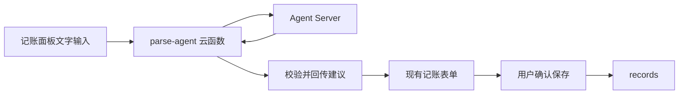

# AI 文字记账 - 接入设计

> 版本：v1.3
> 创建时间：2026-08-04
> 状态：待配置
> 最后更新：2026-08-05

## 设计结论

采用“页面 → 云函数 → Agent Server”的单向解析链路。页面只拿结构化建议并回填现有表单；账单写入保持在现有 `save` 操作中。



## 接口边界

页面请求云函数：

```js
{ text, categories, now }
```

云函数成功返回：

```js
{ amount, type, categoryId, happenAt, note, confidence }
```

云函数负责：请求 Agent Server、超时控制、鉴权、返回字段校验与错误归一化。

页面负责：加载用户分类、提交文字、回填已有表单、展示失败信息。页面不得持有 Agent Server 密钥。

## 安全与约束

- Agent Server 地址和密钥仅配置在云函数运行环境。
- 仅发送完成解析所需的文字、当前时间与用户分类；不发送完整账单历史。
- 服务响应中的分类必须存在于本用户分类集合，否则拒绝该分类建议。
- 设定有限超时，失败不影响本地手动记账。

## 模型提供方

默认采用 SenseNova Chat Completions：云函数以 Bearer API Key 调用 `https://api.sensenova.cn/v1/llm/chat-completions`，模型名由云函数环境变量配置。提示词要求模型只返回账单 JSON；云函数仍会校验金额、类别和日期后才回传页面。

## 待接入项

用户在云函数环境中配置 `SENSENOVA_API_KEY` 后，部署 `cloudfunctions/parse-agent`。可选配置 `SENSENOVA_MODEL`，默认值为 `deepseek-v4-flash`。密钥不写入仓库、`project.private.config.json` 或小程序页面。

---

## 变更日志

- v1.3 调整：云函数改用 SenseNova Chat Completions 与 `SENSENOVA_API_KEY`（2026-08-05）。

- v1.2 实现：新增 `parse-agent` 云函数与首页 AI 填充入口，待配置 Key 并部署（2026-08-04）。

- v1.1 调整：默认模型提供方改为 DeepSeek 直连 API（2026-08-04）。

- v1.0 创建：定义 AI 文字记账的安全接入边界与最小调用契约（2026-08-04）。
