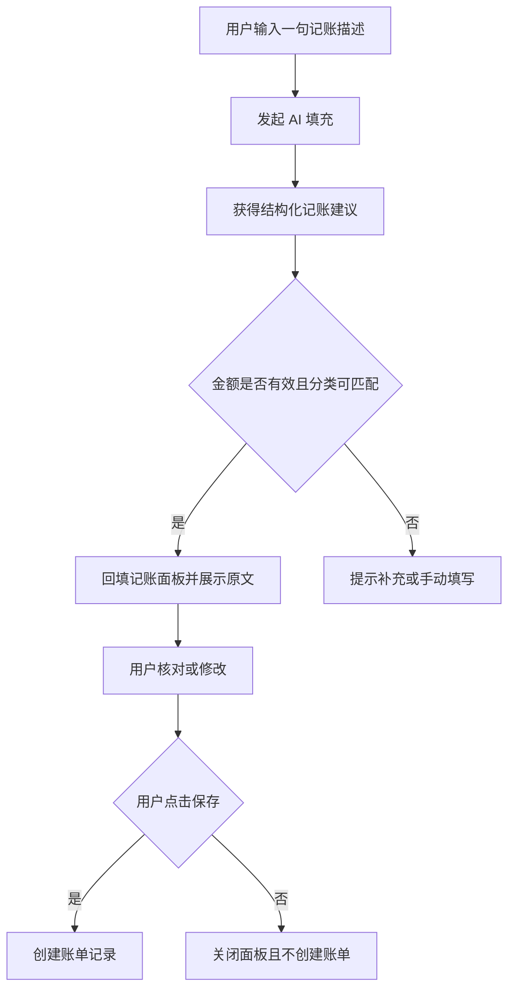

# AI 文字记账 - 需求评审稿

> 版本：v1.3
> 创建时间：2026-08-04
> 状态：已确认
> 最后更新：2026-08-05

## 1. 背景与目标

用户希望输入一句自然语言，例如“今天午饭 28 元”，由 Agent Server 自动识别金额、收支、分类、日期和备注，并回填到现有记账面板。

目标是减少填写步骤；AI 不得直接创建账单，保存仍由用户确认触发。

## 2. 范围与边界

- 新增文字输入入口与“AI 填充”操作。
- 通过小程序云函数转发 SenseNova API 请求，客户端不保存服务地址或密钥。
- 复用现有分类、金额、日期、备注和保存流程。
- 本期不新增聊天记录、连续对话、自动保存或新的账单字段。

## 3. 业务流程

## 4. 页面要求

### 首页记账面板

- 在现有数字键盘上方增加一行文字输入框，示例文案：“例如：昨天打车 32 元”。
- 输入非空后显示“AI 填充”按钮；请求处理中按钮不可重复点击。
- 成功后继续复用现有字段行和保存按钮，用户可覆盖 AI 填入的任何值。
- 失败时保留原始文字和已填写内容，显示可理解的失败提示。

## 5. 数据与记录

- Agent Server 请求仅携带：用户输入原文、当前可用分类（id、名称、类型、关键词）与当前时间。
- Agent Server 必须返回：`amount`、`type`、`categoryId`、`happenAt`、`note`；可附带 `confidence` 与 `reason` 供页面提示。
- 原文仅在当前页面会话用于展示与重试；除非用户明确同意，不新增原文持久化。
- 最终仍沿用 `records` 现有字段写入。

## 6. 失败处理

| 场景 | 页面行为 |
|---|---|
| 服务不可用或超时 | 提示“AI 暂时不可用，请手动填写或重试”，保留文字 |
| 金额缺失或不是正数 | 不回填金额，提示补充金额 |
| 分类不在用户分类中 | 回填“其他”或保持当前分类，并提示用户选择 |
| 返回格式异常 | 视为识别失败，不写入账单 |

每次用户点击可重试一次；不自动循环请求。

## 7. 验收标准

- 输入“今天午饭 28 元”后，能回填支出、金额 28、餐饮分类和今天。
- 输入“昨天收到工资 8000”后，能回填收入、金额 8000、工资分类和昨天。
- AI 结果永远不会直接新增 `records` 数据。
- 用户修改任意回填字段后，保存结果以修改后的值为准。
- 发生超时、网络错误或无效结果时，已有手动记账功能仍可使用。

## 8. 待确认问题

1. Agent Server 的实际调用地址、鉴权方式和请求/响应示例是什么？
2. 是否允许将用户输入原文发送给该服务，以及该服务是否会留存？
3. 分类无法确定时，希望默认“其他支出”还是要求用户必须选择？

---

## 变更日志

- v1.3 调整：模型提供方切换为 SenseNova，继续保持 AI 回填、用户确认保存（2026-08-05）。

- v1.2 确认：采用 DeepSeek，Key 由用户在云函数环境变量中配置（2026-08-04）。

- v1.1 调整：将模型提供方从待定 Agent Server 收敛为 DeepSeek API（2026-08-04）。

- v1.0 创建：归档 AI 文字记账的业务边界、失败处理与验收标准（2026-08-04）。
