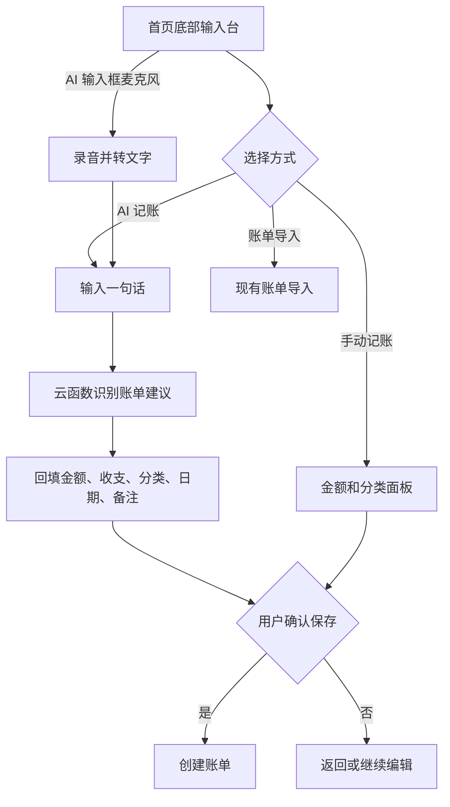

# 首页多模式记账输入台 - 需求评审稿

> 版本：v1.2  
> 创建时间：2026-08-06  
> 状态：首版已实现

## 1. 目标与边界

将首页分散的记账入口收敛为固定在底部的「多模式记账输入台」，降低用户从想到一笔账到进入录入流程的步骤。

本期提供四个入口：

| 模式 | 用户目标 | 本期结果 |
| --- | --- | --- |
| AI 记账 | 用一句自然语言完成录入 | AI 识别后回填现有记账面板，用户确认保存 |
| 手动记账 | 快速输入金额并选分类 | 打开现有金额、分类、日期、备注面板 |
| 账单导入 | 导入已有支付账单 | 进入现有账单页并触发 CSV/TXT 文件选择 |
| AI 记账（含语音） | 用文字或语音完成录入 | 语音仅转写并回填同一个 AI 输入框，再由用户确认识别 |

不新增聊天历史、自动保存、账号同步或新的账单数据字段。AI 绝不直接写入 `records`。

## 2. 用户流程

## 3. 页面与交互要求

### 3.1 首页默认态

- 保持现有紫粉配色、现有首页内容和底部 Tab；不复制参考应用的绿色聊天背景、角色或文案。
- 输入台固定在 TabBar 上方，包含横向可滚动的模式标签、主输入框和右侧语音按钮；安全区不得遮挡输入框或 TabBar。
- 默认选中「AI 记账」。空态显示一句简短引导和示例标签：`午饭 32`、`收红包 200`、`昨天打车 50`。
- 点击示例只填入输入框，不立即调用 AI。

### 3.2 AI 记账

- 输入框点击后使用系统键盘；输入内容支持 200 字以内的单行/自动扩展两行。
- 有内容时显示「识别」发送按钮；请求中禁止重复提交，保留原文。
- 成功后打开既有手动记账面板并回填解析字段；用户仍可编辑、取消或保存。
- MVP 只保证一段文本生成一笔待确认账单。识别到多笔账单时，提示“请逐笔确认”，不静默丢失或自动创建多笔。

### 3.3 手动记账

- 点击「手动记账」直接打开既有手动面板，默认聚焦金额键盘。
- 分类选择继续复用当前分类选择逻辑；不得新增重复分类模型。

### 3.4 账单导入

- 点击「账单导入」进入现有账单页，并自动拉起文件选择；支持范围以现有解析器为准（当前为微信支付 CSV/TXT）。
- 用户取消选择文件后回到账单页，不产生记录。

### 3.5 AI 记账中的语音输入

- 语音不是独立模式；仅保留 AI 输入框右侧麦克风，启动现有讯飞录音流程。
- 转写成功后把文字放入 AI 输入框，并由用户点击「识别」；不在转写成功时自动请求模型。
- 录音/转写失败时保留已输入文本，提供重试和手动输入路径。

## 4. 状态与异常

| 场景 | 期望行为 |
| --- | --- |
| AI 服务失败或超时 | 提示失败，保留原文；可重试或切换手动记账 |
| AI 缺少金额 | 不打开保存态，提示补充金额 |
| 分类置信度低/无法匹配 | 保持默认分类，要求用户在面板中选择 |
| 录音权限被拒 | 引导到权限设置；手动输入始终可用 |
| 导入文件不支持或解析失败 | 显示现有导入错误，不创建部分账单 |

## 5. 验收标准

- 首页可在不滚动页面的情况下看到 AI 记账、手动记账、账单导入三个模式；AI 输入框右侧始终提供语音按钮。
- AI 输入“午饭 32 元”后，必须先展示可编辑的待保存内容，再由用户保存。
- 手动入口能直接进入金额输入和分类选择。
- 账单导入不改变现有账单导入格式和校验规则。
- 任意失败都不妨碍用户继续手动记账；底部输入台在安全区设备上不被遮挡。

## 6. 待确认

1. 多笔文本（如“午饭 32，打车 18”）本期是否要做成“多张待确认卡片”？该能力会改变现有单笔 AI 回填流程。
2. 账单导入是否只保留当前微信支付 CSV/TXT，还是需要支付宝等格式？

## 变更记录

- v1.0：基于“团团记账”参考，将首页入口收敛为 AI、手动、导入、语音四种模式（2026-08-06）。
- v1.0 → v1.1：语音从独立模式并入 AI 记账输入框（2026-08-06）。
  - 变更内容：取消“语音输入”模式标签，仅保留 AI 输入框右侧麦克风。
  - 变更原因：语音的产物是文本，应与文字 AI 记账共用同一条确认流程。
- v1.1 → v1.2：完成首页三模式输入台首版实现（2026-08-06）。
  - AI 识别成功后打开现有金额、分类确认面板；语音仅回填 AI 文本框。
  - 账单导入通过临时意图切换至账单 Tab，并拉起既有文件选择。
