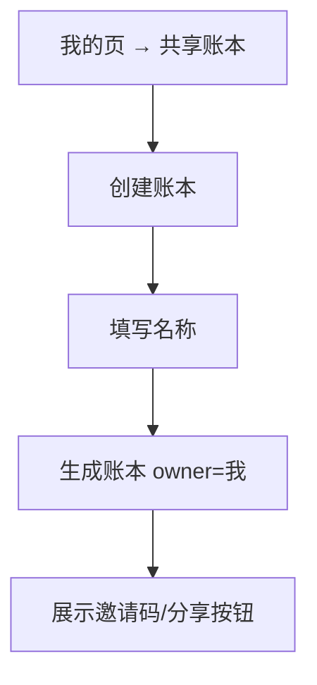
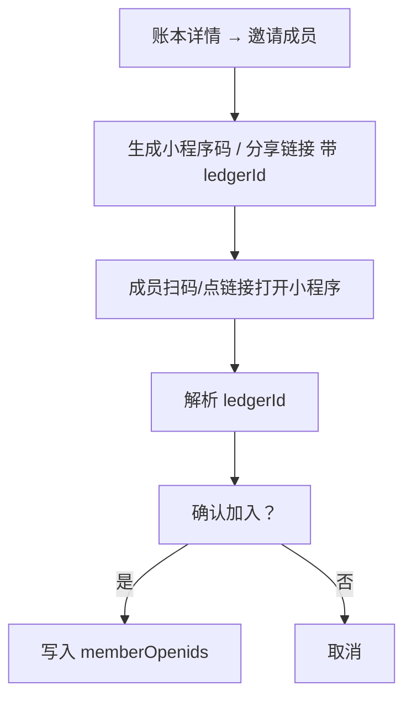

# 共享账本（家庭账单 / 出游 AA） - 需求评审稿

> 版本：v0.1
> 创建时间：2026-08-11
> 状态：首版已实现

## 1. 目标与边界

### 1.1 背景

记账小程序目前是**单用户**模式：每人只能看到自己的账（records 按 `_openid` 隔离）。但实际生活中存在**多人共享记账**的真实场景：

- **家庭场景**：城市一家人（夫妻、父母、孩子）共同记录家庭支出，查看家庭总体统计——"我们这个月花了多少"。
- **出游场景**：一伙人出去玩，由**一人统一记账**（垫付人记录），同伴加入账本查看消费明细，结束后拿账单分摊（分摊计算本身本期不做）。

本期将两者统一为「**共享账本**」能力：一个账本 = 一组人 + 一笔共享的账单数据源。

### 1.2 本期范围（MVP）

| 能力 | 本期 | 说明 |
| --- | --- | --- |
| 创建共享账本 | ✅ | 填名称即创建，不区分「家庭/出游」类型（名称自定，如"我们家"/"8月海边游"） |
| 邀请加入 | ✅ | 小程序码 + 分享链接，扫码/点链接确认加入 |
| 账本内共享记账 | ✅ | 成员可把账记到共享账本，全员可见 |
| 共享统计 | ✅ | 按账本聚合，看全体成员汇总（复用现有统计逻辑） |
| 个人/账本切换 | ✅ | 记账页默认记个人，可切换到共享账本 |
| 退出账本 | ✅ | 成员可退出 |
| 管理员功能（踢人/解散/转让） | ⏸ 二期 | 本期不做 |
| 分摊计算（AA 明细） | ⏸ 二期 | 本期不做，但 records 预留 `ledgerId` 字段，二期可扩展 |

### 1.3 不做的事

- **不迁移**历史个人数据到共享账本（共享账本从创建后开始记）。
- **不做**分摊计算、账单"谁付的/谁该摊"标记。
- **不做**账本内角色权限（全部成员平等：都可记账、可看全部记录）。
- **不做**多人同时编辑的冲突处理（账本内记录各自独立，互不覆盖）。

## 2. 数据模型

### 2.1 新集合 `ledgers`（账本）

```js
{
  _id: '自动生成',
  name: '我们家',            // 账本名称
  ownerOpenid: 'oXX...',      // 创建者 openid
  memberOpenids: ['oXX...'],  // 全部成员 openid 数组（含 owner）
  createdAt: 1786000000000    // 创建时间
}
```

### 2.2 `records` 增加字段

```js
{
  ...现有字段,
  ledgerId: 'ledger_xxx' | null   // 归属账本；null/缺省 = 个人账
}
```

### 2.3 集合权限（关键改造）

现状：`records` 为「仅创建者可读写」，家庭成员无法互相读取。

改造方案（选一）：

- **方案 A（推荐）**：`records` 权限改为「所有用户可读，仅创建者可写」，前端按 `ledgerId` + `_openid` 过滤；共享账本记录通过云函数读取（云函数有管理员权限）。
- **方案 B**：`records` 保持「仅创建者可读写」，所有共享账本读写都走云函数（`ledger` 云函数统一处理创建/加入/读写）。安全但查询链路重。

> 待确认：两种方案实现成本与安全性的取舍，详见第 6 节。

## 3. 用户流程

### 3.1 创建账本



### 3.2 邀请与加入



### 3.3 共享记账

- 记账页新增「账本切换」：**个人 / 共享账本（下拉或标签）**。
- 选择共享账本后，`save()` 写入 records 时带 `ledgerId`。
- 共享账本内所有成员都能看到该账本下所有记录（账单页按账本过滤）。

### 3.4 共享统计

- 统计页新增「个人 / 共享账本」切换。
- 共享统计：`aggregate` 云函数按 `ledgerId` 聚合（不再按 `_openid`），输出与现有统计一致的结构（收支总额、分类占比、环比等）。

## 4. 页面与交互

### 4.1 我的页

- 新增「共享账本」入口卡片。
- 进入后：我的账本列表（我创建的 / 我加入的）、创建按钮、当前账本详情。

### 4.2 账本详情页

- 账本名称、成员列表（头像/昵称）、邀请成员按钮、退出账本按钮。
- 账本记录入口（可跳到账单页按账本过滤）。

### 4.3 记账页

- 输入台下方或面板内新增账本选择（个人 / 各共享账本）。
- 默认「个人」，记忆上次选择。

### 4.4 统计页

- 顶部新增「个人 / 共享账本」切换。
- 共享账本模式下，统计口径为全体成员。

## 5. 状态与异常

| 场景 | 期望行为 |
| --- | --- |
| 扫码加入时账本不存在 | 提示"账本不存在或已解散" |
| 已是该账本成员 | 直接进入账本，不重复添加 |
| 退出账本后 | 该账本记录不再显示；个人记录不受影响 |
| 账本成员数超上限（10人） | 提示"账本人数已满" |
| 创建账本重名 | 允许重名（名称不唯一），不做限制 |
| 网络异常 | 提示重试，不产生半成品数据 |

## 6. 待确认

1. **权限方案**：方案 A（改 records 权限 + 云函数读共享）vs 方案 B（全走云函数）。A 实现较轻但依赖安全规则；B 更安全但改动大。倾向 A。
2. **邀请载体**：小程序码（需申请小程序码接口权限）vs 分享链接（onShareAppMessage 带参数）。倾向两者都做，链接为主。
3. **统计切换**：共享统计是否包含"成员各自贡献"（每人花了多少）？本期只做全体汇总，成员明细二期。

## 变更记录

- v0.1：创建共享账本需求初稿（2026-08-11）。
- v0.1 → v0.2：完成首版实现（2026-08-11）。
  - 新增 ledger 云函数（创建/加入/退出/列表/详情/记录读取，成员校验）。
  - aggregate 云函数支持按 ledgerId 聚合（共享统计）。
  - 新增 ledger-list / ledger-detail 页面；我的页加入口。
  - 记账页「个人/共享账本」切换（保存带 ledgerId）。
  - 统计页、账单页支持账本切换（账单页共享只读）。
  - 邀请：分享链接带 ledgerId，扫码打开自动加入。
