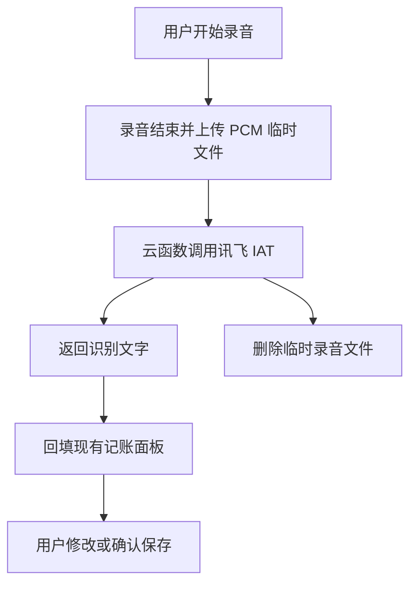

# 讯飞语音听写替换 - 需求确认

> 版本：v1.0
> 创建时间：2026-08-05
> 状态：已确认
> 最后更新：2026-08-05

## 目标与范围

将语音记账的服务端识别能力从腾讯云 ASR 更换为讯飞语音听写（IAT）。录音、表单回填和“用户确认后保存”的既有交互不变。

## 业务流程

## 数据与安全

- 云函数仅读取 `XFYUN_APP_ID`、`XFYUN_API_KEY`、`XFYUN_API_SECRET` 环境变量。
- 不在代码、云存储或账单记录中保存讯飞凭证。
- 临时 PCM 文件在识别成功或失败后均删除。
- 语音文本继续只用于表单回填，不自动创建账单。

## 异常与验收

- 未配置三元组时提示“讯飞语音服务尚未配置”。
- 识别失败、超时或空文本时保留手动记账路径。
- 仅接受 16k、16bit、单声道 PCM，最长 60 秒。
- 识别成功后能回填金额、收支、分类、日期和备注；仍需用户点击保存。

---

## 变更日志

- v1.0 创建：确认讯飞 IAT 替换现有语音识别服务（2026-08-05）。
